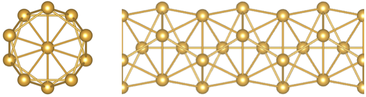

Files to run a genetic algorithm structure search for Au wires with a maximum diameter of 5 Angstroms, using the EAM potential of Foiles *et al.* that ships with LAMMPS.  

Description of files
====================

ga_input.yaml 

	Main input file for GASP. See the `usage file`_ for descriptions of each keyword and option. 

.. _usage file: ../../docs/usage.md

in.min 

	LAMMPS input script.

Au_u3.eam 

	LAMMPS file containing the EAM potential.

calllammps 

	Script called by GASP to run a LAMMPS calculation.

Running the search
==================

Instructions for running this search on your system are given below. 

Note that we assume GASP-python and LAMMPS are already installed on your system. If this is not the case, see the `main README file`_ and the `LAMMPS documentation`_ for instructions on how to get GASP-python and LAMMPS, respectively. 

.. _main README file: ../../README.rst
.. _LAMMPS documentation: http://lammps.sandia.gov/download.html 

1. Copy all files to the location on your computer where you would like to run the search.

2. Modify the location of the LAMMPS input script given in ga_input.yaml (on line 6). Replace it with the location of the in.min file on your computer.  

3. Modify the location of the LAMMPS potential file given in in.min (on line 8). Replace it with the location of the Au_u3.eam file on your computer. Note that '## Au' must appear at the end of the line after the location. 

4. Modify the location of the LAMMPS binary given in calllammps (on line 15). Replace it with the location of the LAMMPS binary on your computer. 

5. Move calllammps to a location in your system's PATH and make it executable.  

6. To start the search and pipe the output to a file called ga_output, move into the folder containing ga_input.yaml and type::

	run.py ga_input.yaml 2>&1 | tee ga_output

When we ran this search, GASP found a wire structure composed of 5 atom rings surrounding a central linear chain (shown below) to have the lowest energy. 

